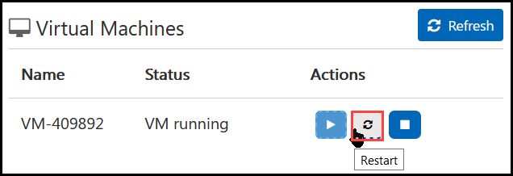

# Getting Started with Dashboard in a Day Lab

1. Once the environment is provisioned, a virtual machine (JumpVM) and lab guide will get loaded in your browser. Use this virtual machine throughout the workshop to perform the the lab.
1. To get the lab environment details, you can select **Environment Details** tab. Additionally, the details will also be emailed to your email address provided at registration.

   
 
   > You will see VM details in the **Lab Environment** tab
 
1. You can also seperate the lab guide and the virtual machinbe provided for the lab to view in seperate full window by clicking on the *Split Window* button at the bottom right corner of the screen.

   
 
## Start/Stop the Virtual Machine
1. Click on the  **Virtual Machines tab** available next to the Environment Details tab as mentioned in the screenshot below.

   

1. To Start the VM, on the Virtual Machines tab click on the **Start** icon as shown below.

   

1. To Stop the VM, on the Virtual Machines tab click on the **Deallocate** icon as shown below.

   

1. To Restart the VM, on the Virtual Machines tab click on the **Restart** icon as shown below.

   

## Environemnt Setup and Overview
Your **odl_user** is provided with the *PowerBI* license.
   
Now you can proceed with the rest of the exercises that are available in the lab VM at ***C:\DIAD\Attendee\A4***, you can start from **Lab 1 - Accessing and Preparing Data A4**.
